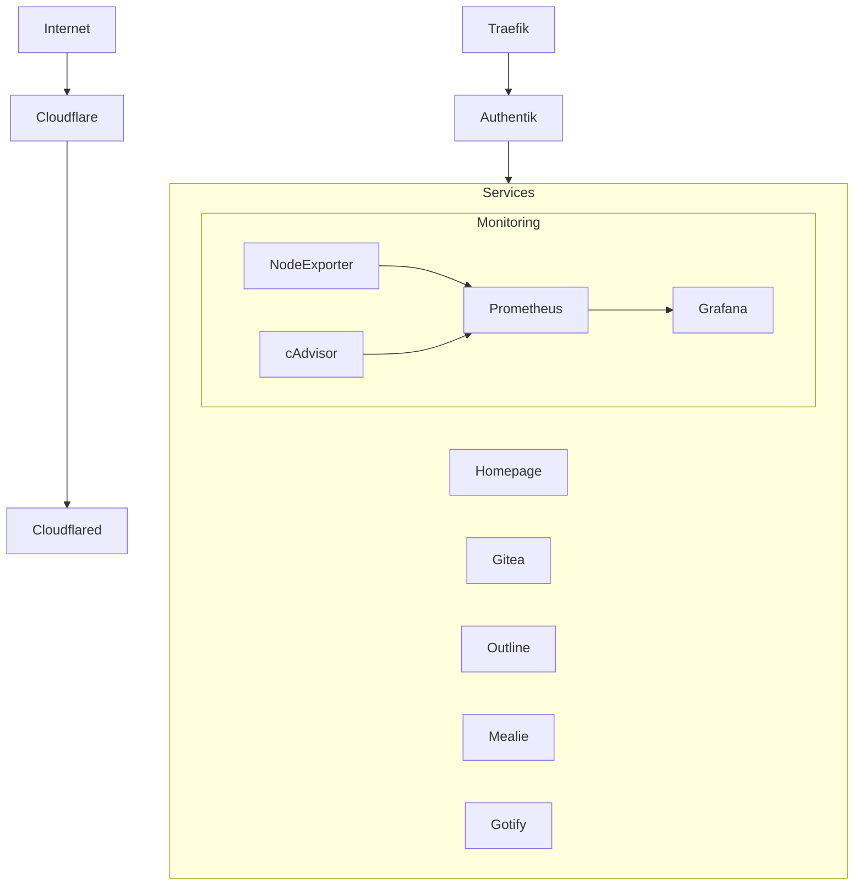

# 🏠 Homelab Blueprint

# 🏠 Homelab Blueprint

[](https://docs.docker.com/compose/)
[]()
[](LICENSE)


This repository contains the configuration for a complete homelab setup using Docker containers. It's designed to be a starting point for your own homelab, with security and best practices in mind.

## 🌟 Features

- **Reverse Proxy**: Traefik with automatic SSL certificates
- **Authentication**: Authentik for SSO across services
- **Monitoring**: Grafana, Prometheus, Node Exporter, cAdvisor
- **Git Services**: Gitea with Drone CI
- **Documentation**: Outline Wiki
- **Recipe Management**: Mealie
- **Notifications**: Gotify, NTFY
- **Dashboard**: Homepage for service organization
- **Database**: PostgreSQL with pgAdmin
- **Caching**: Redis with RedisInsight

## 🏗️ Architecture



## 📋 Prerequisites

- Docker and Docker Compose
- Domain name with DNS records pointing to your server
- Basic understanding of Docker and networking
- Reverse proxy understanding (Traefik)

## 🚀 Quick Start

1. Clone this repository:
```bash
git clone https://github.com/yourusername/homelab-blueprint.git
cd homelab-blueprint
```

2. Create `.env` files:
```bash
# Create .env files from examples for each service
find . -name ".env.example" -exec sh -c 'cp "$1" "${1%.example}"' _ {} \;
```

3. Configure your domains:
- Replace `<yourinternaldomain>` with your internal domain (e.g., `*.home.mydomain.com`)
- Replace `<yourexternaldomain>` with your external domain (e.g., `*.mydomain.com`)

4. Start the services:
   > ⚠️ **Warning:** Make sure all `.env` files and configuration steps are correctly set up before using the quick start script.

   You have two options:

   **Option 1: Sequential start (recommended for first run)**
   ```bash
   # Create Docker network
   docker network create app-network

   # Start services in order
   cd postgres && docker compose up -d
   cd ../authentik && docker compose up -d
   cd ../traefik && docker compose up -d
   ```

   **Option 2: Quick start (after initial setup)**
   
   ```bash
   # Use the provided start script
   chmod +x start-all.sh
   ./start-all.sh
   ```
   This script will automatically start all services. You can exclude by adding the name of the directory to the variable `IGNORED_PATHS` in the script like so:
   ```bash
   IGNORED_PATHS=("./directory1" "./directory2")
   ```


## 🔐 Security Considerations

1. **Environment Variables**:
   - Never commit `.env` files
   - Use `.env.example` files as templates
   - Generate strong passwords and keys

2. **Network Security**:
   - All services are behind Traefik reverse proxy
   - SSO with Authentik
   - Internal services accessible only on internal domain

3. **Monitoring**:
   - System metrics with Prometheus
   - Container metrics with cAdvisor
   - Host metrics with Node Exporter

## 📁 Directory Structure

```
homelab-blueprint/
├── authentik/        # SSO authentication
├── gitea/           # Git service
├── homepage/        # Dashboard
├── monitoring_stack/ # Grafana, Prometheus, etc.
├── outline/         # Wiki
├── postgres/        # Database
├── redis/          # Caching
├── traefik/        # Reverse proxy
└── [other services]/
```

## ⚙️ Configuration

Each service directory contains:
- `compose.yml`: Docker Compose configuration
- `.env.example`: Template for environment variables
- `config/`: Service-specific configurations

### Required Configuration

1. **DNS Records**:
   - Create A/AAAA records for your domain
   - Point them to your server's IP

2. **Environment Variables**:
   - Create `.env` files from `.env.example`
   - Fill in required variables

3. **Traefik**:
   - Configure SSL certificates
   - Set up authentication middleware

4. **Cloudflare Tunnels**:
   - This setup uses Cloudflare Tunnels for secure external access
   - No ports need to be opened on your router/firewall
   - Setup steps:
     1. Create a Cloudflare account and add your domain
     2. Copy the tunnel token to `cloudflared/.env`
     3. Configure DNS records in Cloudflare dashboard to point to your tunnel

   The cloudflared service will automatically establish a secure connection between your services and Cloudflare's edge network, providing SSL certificates and DDoS protection. No need to punch holes in your firewall or expose your services directly to the internet.

## 📚 Documentation

- Each service is documented in its respective directory
- Configuration examples are provided
- Security best practices are outlined

## 🛠️ Maintenance

1. **Updates**:
   - DIUN for Docker image update notifications
   - Regular security updates

2. **Backups**:
   - Database backups
   - Configuration backups
   - Docker volume backups

## 🤝 Contributing

Feel free to submit issues and pull requests!

## ⚖️ License

This project is licensed under the MIT License - see the LICENSE file for details.

## 🙏 Acknowledgments

- All the amazing open-source projects used
- Docker and container community
- Homelab community

## ⚠️ Disclaimer

This is a blueprint - make sure to:
- Change default passwords
- Review security settings
- Adapt to your needs
- Test thoroughly before production use